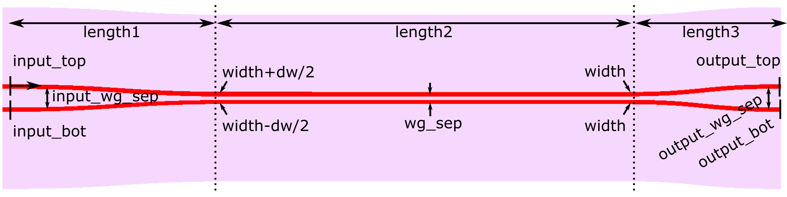
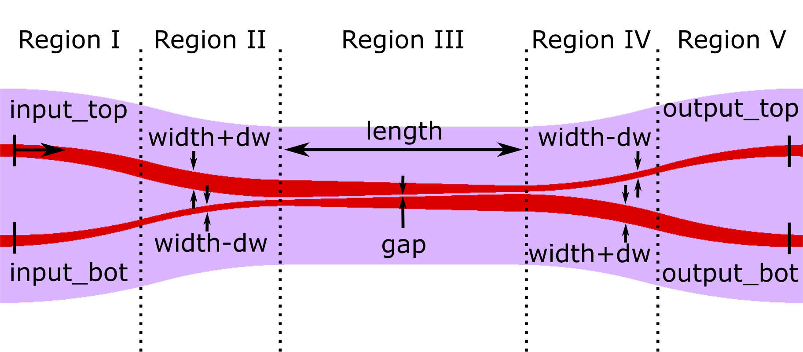

Waveguide Couplers
+++++++++++++++++++

------------------------------
Directional Coupler
------------------------------

.. automodule:: picwriter.components
   :members: DirectionalCoupler

.. image:: imgs/dc.png

------------------------------
Adiabatic 3dB Coupler
------------------------------

.. automodule:: picwriter.components
   :members: AdiabaticCoupler

------------------------------
Adiabatic Full Coupler
------------------------------

.. automodule:: picwriter.components
   :members: FullCoupler

------------------------------------------------------------
Sub-wavelength Grating Assisted Contra-Directional Coupler
------------------------------------------------------------

For more details on the principles and operation behind this type of component, please see https://doi.org/10.1364/OE.25.025310. This component uses one regular waveguide (at top) and one sub-wavelength grating (at bottom) to selectively reflect a certain spectral band to the `input_bot` port.  Apodization of the top waveguide is also supported.

.. automodule:: picwriter.components
   :members: SWGContraDirectionalCoupler

.. image:: imgs/swgcontradc.png
.. image:: imgs/swgcontradc_zoom.png

------------------------------
Example Usage
------------------------------

.. image:: imgs/dc_matrix.png

The directional coupler matrix shown above is generated by::

    top = gdspy.Cell("top")
    wgt = WaveguideTemplate(bend_radius=100, resist='+')

    wg1=Waveguide([(0,0), (100,0)], wgt)
    tk.add(top, wg1)

    dc1 = DirectionalCoupler(wgt, 10.0, 0.5, angle=np.pi/6.0, parity=1, **wg1.portlist["output"])
    dc2 = DirectionalCoupler(wgt, 10.0, 0.5, angle=np.pi/6.0, parity=-1, **dc1.portlist["output_top"])
    dc3 = DirectionalCoupler(wgt, 10.0, 0.5, angle=np.pi/6.0, parity=1, **dc1.portlist["output_bot"])
    dc4 = DirectionalCoupler(wgt, 10.0, 0.5, angle=np.pi/6.0, parity=1, **dc2.portlist["output_bot"])
    dc5 = DirectionalCoupler(wgt, 10.0, 0.5, angle=np.pi/6.0, parity=-1, **dc2.portlist["output_top"])
    dc6 = DirectionalCoupler(wgt, 10.0, 0.5, angle=np.pi/6.0, parity=1, **dc3.portlist["output_bot"])
    tk.add(top, dc1)
    tk.add(top, dc2)
    tk.add(top, dc3)
    tk.add(top, dc4)
    tk.add(top, dc5)
    tk.add(top, dc6)
