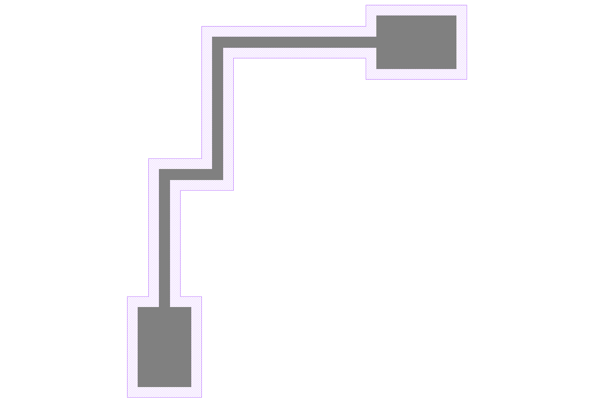

Metal Templates, Routes, & Bondpads
++++++++++++++++++++++++++++++++++++

Metal Template
------------------

.. automodule:: picwriter.components
   :members: MetalTemplate
   
Metal Routes
------------

.. automodule:: picwriter.components
   :members: MetalRoute
   
Bondpads
---------

.. automodule:: picwriter.components
   :members: Bondpad

The above was generated with::

    top = gdspy.Cell("top")
    mt = MetalTemplate(bend_radius=0, resist='+', fab="ETCH")

    mt1=MetalRoute([(0,0), (0,250), (100,250), (100,500), (400,500)], mt)
    bp1 = Bondpad(mt, **mt1.portlist["output"])
    bp2 = Bondpad(mt, **mt1.portlist["input"])
    tk.add(top, bp1)
    tk.add(top, bp2)
    tk.add(top, mt1)
