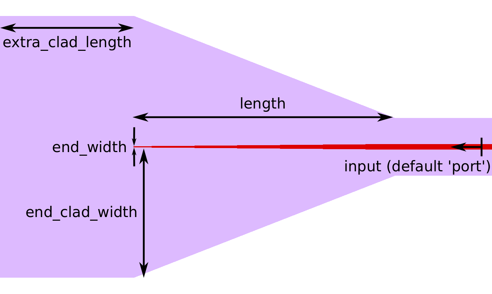
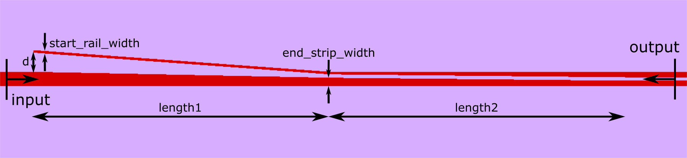
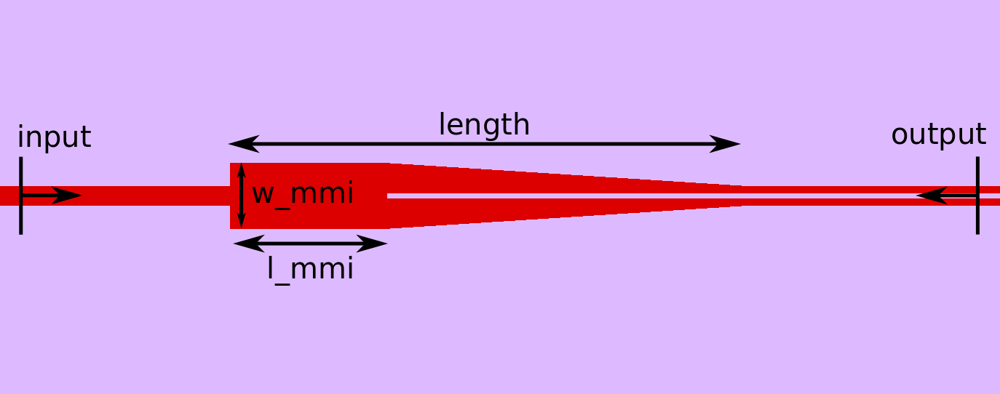
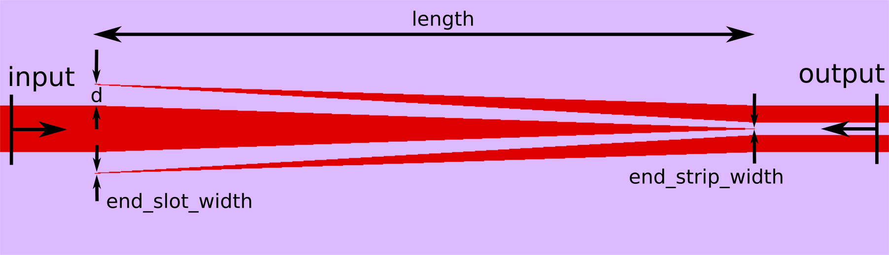

Mode converters
++++++++++++++++

----------------------------
Linear tapers
----------------------------

Below is a standard taper class that can be used to generate inverse-tapered waveguide couplers or wide to narrow tapered couplers.

.. automodule:: picwriter.components
   :members: Taper

------------------------------
Strip-to-slot mode converters
------------------------------

.. automodule:: picwriter.components
   :members: StripSlotConverter

.. automodule:: picwriter.components
   :members: StripSlotMMIConverter

.. automodule:: picwriter.components
   :members: StripSlotYConverter

