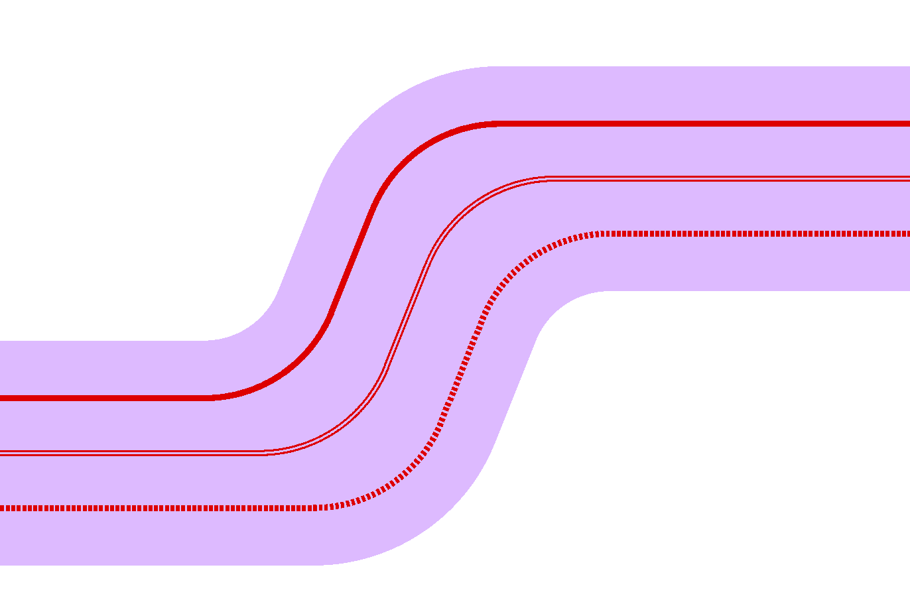
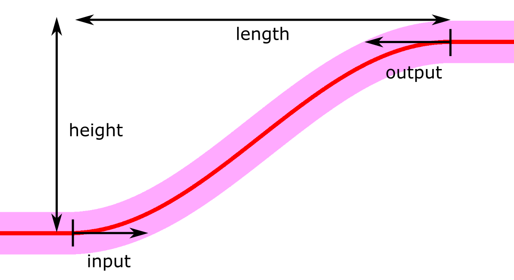

Waveguides & Waveguide Templates
++++++++++++++++++++++++++++++++

Waveguide Template
--------------------

Waveguide template objects are used to define a standard set of parameters (width, cladding, layers, etc.) that is passed to waveguide routes and PICwriter components.

.. automodule:: picwriter.components
   :members: WaveguideTemplate

.. image:: imgs/waveguide_zoom.png
	:width: 60%

Example usage:

To generate a strip waveguide template with 1.0um width and 25.0um bending radius::

    wgt= WaveguideTemplate(wg_type='strip', wg_width=1.0, bend_radius=25)

To generate a slot waveguide with 1.0um width, 25.0um bending radius, and a 0.3um slot in the center::

	wgt = WaveguideTemplate(wg_type='slot', wg_width=1.0, bend_radius=25.0, slot=0.3)

To generate a sub-wavelength grating waveguide with 1.0um width, 25.0um bending radius, 50% duty-cycle, and a 1um period::

	wgt= WaveguideTemplate(wg_type='swg', wg_width=1.0, bend_radius=25, duty_cycle=0.50, period=1.0)

Waveguides
------------

Waveguide objects are fully defined by a WaveguideTemplate object as well as a list of (x,y) points that determine where the waveguide is routed.

.. automodule:: picwriter.components
   :members: Waveguide

Example usage to generate a waveguide with waypoints::

	top = gdspy.Cell('top')
	wgt= WaveguideTemplate(wg_type='strip', wg_width=1.0, bend_radius=25)
	waypoints = [(0, 0), (200, 0), (250, 100), (400, 100)]
	wg = Waveguide(waypoints, wgt)
	tk.add(top, wg)
	gdspy.LayoutViewer()

Bends
------------

.. automodule:: picwriter.components
   :members: SBend
   
