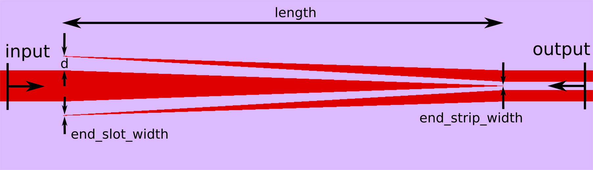

****************************
Couplers
****************************

============================
Edge couplers
============================

Below is a standard taper class that can be used to generate inverse-tapered waveguide couplers or wide to narrow tapered couplers.
   
.. automodule:: picwriter.components
   :members: Taper
   
.. image:: imgs/taper.png

============================
Strip-to-slot couplers
============================

Provided below is a standard Y-junction strip-to-slot waveguide coupler.  For more information on this, please see the original paper at https://doi.org/10.1364/OL.34.001498.

.. automodule:: picwriter.components
   :members: StripSlotYCoupler
   

