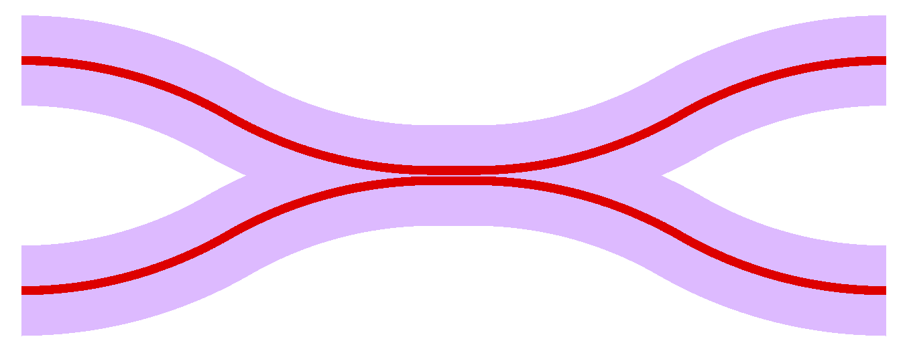
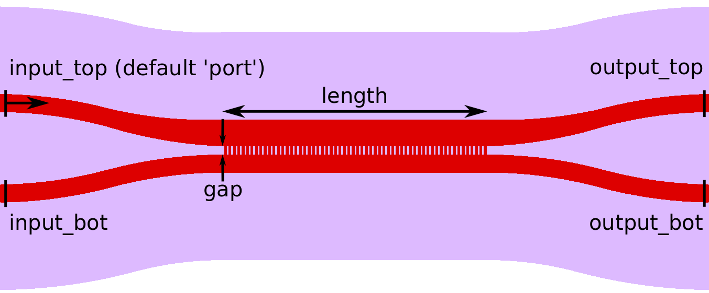
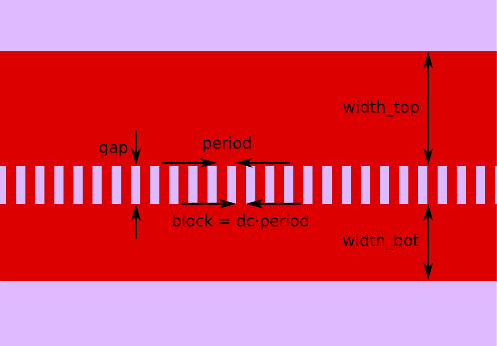
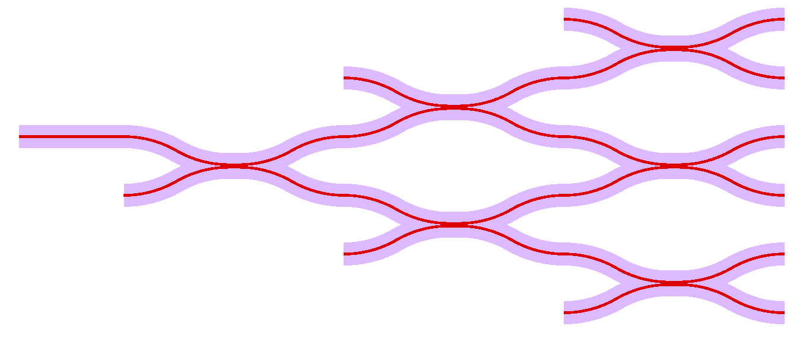

****************************
Directional Couplers
****************************

============================
Standard Directional Coupler
============================
   
.. automodule:: picwriter.components
   :members: DirectionalCoupler
   

==============================================
Contra-Directional Coupler (Grating Assisted)
==============================================

.. automodule:: picwriter.components
   :members: ContraDirectionalCoupler
   

   
============================
Example Usage
============================

The directional coupler matrix shown above is generated by::

    top = gdspy.Cell("top")
    wgt = WaveguideTemplate(bend_radius=100, resist='+')

    wg1=Waveguide([(0,0), (100,0)], wgt)
    tk.add(top, wg1)
    
    dc1 = DirectionalCoupler(wgt, 10.0, 0.5, angle=np.pi/6.0, parity=1, **wg1.portlist["output"])
    dc2 = DirectionalCoupler(wgt, 10.0, 0.5, angle=np.pi/6.0, parity=-1, **dc1.portlist["output_top"])
    dc3 = DirectionalCoupler(wgt, 10.0, 0.5, angle=np.pi/6.0, parity=1, **dc1.portlist["output_bot"])
    dc4 = DirectionalCoupler(wgt, 10.0, 0.5, angle=np.pi/6.0, parity=1, **dc2.portlist["output_bot"])
    dc5 = DirectionalCoupler(wgt, 10.0, 0.5, angle=np.pi/6.0, parity=-1, **dc2.portlist["output_top"])
    dc6 = DirectionalCoupler(wgt, 10.0, 0.5, angle=np.pi/6.0, parity=1, **dc3.portlist["output_bot"])
    tk.add(top, dc1)
    tk.add(top, dc2)
    tk.add(top, dc3)
    tk.add(top, dc4)
    tk.add(top, dc5)
    tk.add(top, dc6)
    

