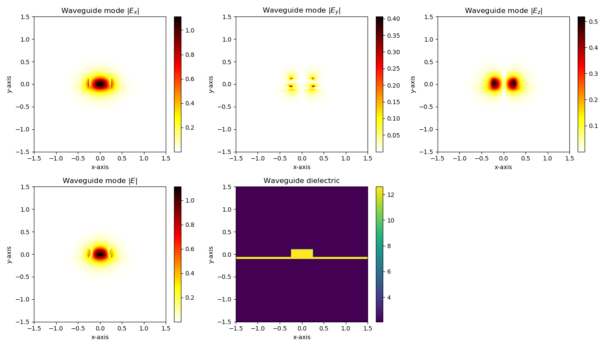
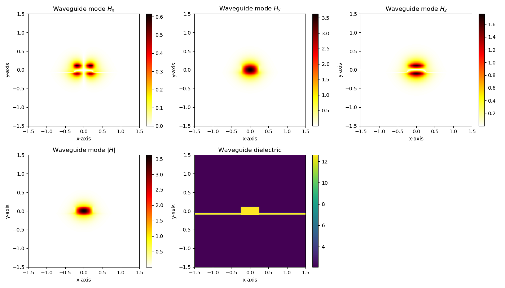
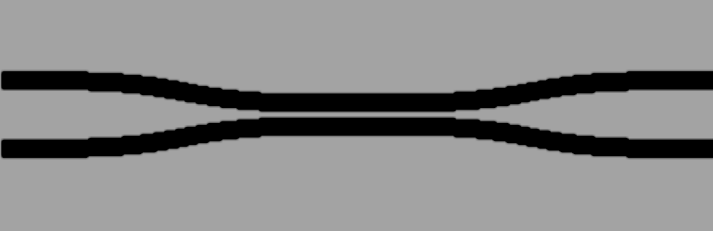
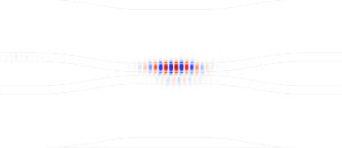
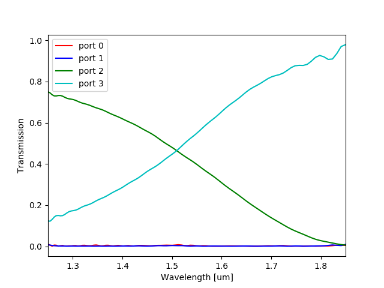

Simulations with PICwriter
************************************

The 3-dimensional geometry of all PICwriter components (a scalar dielectric function) can be exported to an `HDF5 <https://support.hdfgroup.org/HDF5/whatishdf5.html>`_ file format for simulation using various open-source and commercial electromagnetic simulation software.  Convenient functions are also provided for automatically computing the transmission/reflection spectra of PICwriter components with arbitrary numbers of ports (specified by their portlist) using freely available finite-difference time-domain (FDTD) software (`MEEP <https://meep.readthedocs.io/en/latest/>`_).

In order to specify the vertical profile in the vertical (out-of-plane) direction, the user must first specify a **`MaterialStack`** object that is responsible for mapping each mask layer/datatype to a vertical stack of materials.

Defining 3D geometries using PICwriter
---------------------------------------

The mapping of GDSII layers/datatypes to vertical dielectric profiles is done by creating a *MaterialStack* object and adding *VStacks* for each layer/datatype to be considered.  An example of creating a MaterialStack is given below::

    import picwriter.picsim as ps
    
    epsSiO2 = 1.444**2
    epsSi = 3.55**2
    etch_stack = [(epsSiO2, 1.89), (epsSi, 0.07), (epsSiO2, 2.04)]
    mstack = ps.MaterialStack(vsize=4.0, default_stack=etch_stack, name="Si waveguide")
    waveguide_stack = [(epsSiO2, 1.89), (epsSi, 0.22), (epsSiO2, 1.89)]
    clad_stack = [(epsSiO2, 1.89), (epsSi, 0.05), (epsSiO2, 2.06)]
    mstack.addVStack(layer=1, datatype=0, stack=waveguide_stack)
    mstack.addVStack(layer=2, datatype=0, stack=clad_stack)
    
First, we import the picsim library Next, we specified the dielectric constant for the two materials considered (silicon and silicon dioxide at a wavelength of 1550 nm).  Then, we create a VStack list (`etch_stack`), that is in the format [(dielectric1, thickness1), (dielectric2, thickness2), ...].  Withthis we can create the MaterialStack object, with `etch_stack` the default vertical stack in the domain.  Next, we create a `waveguide_stack` VStack list and associate it with the (1,0) GDSII layer using the `addVStack` call.

Quickly computing mode profiles
---------------------------------

With a properly defined material stack, PICsim makes it easy to quickly view the mode profile corresponding to your layout's WaveguideTemplate with the `compute_mode()` function::

    import picwriter.components as pc

    wgt = pc.WaveguideTemplate(bend_radius=15, wg_width=0.5, clad_width=3.0,
                               wg_layer=1, wg_datatype=0, clad_layer=2, clad_datatype=0)
    
    ps.compute_mode(wgt, mstack, res=128, wavelength=1.55, sx=3.0, sy=3.0, 
                    plot_mode_number=1, polarization="TE")
    				
Which produces plots of the corresponding electric fields:

and magnetic fields:

Computing the transmission/reflection spectra
-----------------------------------------------

Likewise, we can build a PICwriter component in the normal way and directly launch a MEEP simulation.  Below we build a DirectionalCoupler object and give it 2 um of waveguide at all the inputs/outputs (this will be useful when we simulate with MEEP later)::

    import picwriter.toolkit as tk
    from picwriter.components import *
    import numpy as np
    import gdspy
    
    top = gdspy.Cell("top")
    wgt = WaveguideTemplate(bend_radius=15, wg_width=0.5, clad_width=3.0,
                            wg_layer=1, wg_datatype=0, clad_layer=2, clad_datatype=0)
    
    simulated_component = gdspy.Cell('sc')                        
    
    dc = DirectionalCoupler(wgt, 3.5, 0.2, angle=np.pi/16.0, 
    						parity=1, direction='EAST', port=(0,0))
    tk.add(simulated_component, dc)
     
    x0,y0 = dc.portlist['input_top']['port']
    x1,y1 = dc.portlist['input_bot']['port']
    x2,y2 = dc.portlist['output_top']['port']
    x3,y3 = dc.portlist['output_bot']['port']
    
    PML_wg1 = Waveguide([(x0,y0), (x0-2,y0)], wgt)
    PML_wg2 = Waveguide([(x1,y1), (x1-2,y1)], wgt)
    PML_wg3 = Waveguide([(x2,y2), (x2+2,y2)], wgt)
    PML_wg4 = Waveguide([(x3,y3), (x3+2,y3)], wgt)
    
    tk.add(simulated_component, PML_wg1)
    tk.add(simulated_component, PML_wg2)
    tk.add(simulated_component, PML_wg3)
    tk.add(simulated_component, PML_wg4)
    
The gdspy Cell object `simulated_component` now contains four short waveguides and a DirectionalCoupler object.  In order to launch a MEEP simulation and compute transmission/reflection spectra, we need to tell PICwriter what `ports` we want to monitor the flux through::

    ports = [dc.portlist['input_top'],
             dc.portlist['input_bot'],
             dc.portlist['output_top'],
             dc.portlist['output_bot']]
             
The first port specified in the list above will be the inport where MEEP will place an EigenmodeSource. The last step is calling `compute_transmission_spectra` with the simulated component, MaterialStack, ports, and some additional information about the simulation::

    ps.compute_transmission_spectra(simulated_component, mstack, wgt, ports, port_vcenter=0,
                                port_height=1.5*0.22, port_width=1.5*wgt.wg_width, dpml=0.5,
                                res=20, wl_center=1.55, wl_span=0.6, fields=True,
                                norm=True, parallel=True, n_p=4)
                                    
In the above *port_vcenter* specifies the center of the port in the vertical direction, *port_height* and *port_width* are the cross-sectional size of the power flux planes, *res* is the resolution (in pixels/um), *wl_center* and *wl_span* specify the center wavelength and wavelength span of the input pulse (in um), *fields* = True tells MEEP to output images of the electric field profile every few timesteps, *norm* = True tells MEEP to first perform a normalization calculation (straight waveguide) using the *wgt* WaveguideTemplate parameters.  *parallel* specifies if the simulation should be run using multiple processor cores (requires MEEP/MPB to be built using parallel libaries), and *n_p* then specifies the number of cores to run on.

*NOTE*: This function requires MEEP and MPB to be compiled (from source) together, so that MEEP can call MPB to input an EigenmodeSource at the first port location.

The resulting structure that is simulated and several field images are shown below:

.. image:: imgs/mcts-ez-topview.t124.png
   :width: 1000px
   :align: center

The `compute_transmission_spectra()` function will also compute and plot the appropriately normalized transmission/reflection spectra, saving the .png image in the working directory.  The raw power flux data is also saved in .out and .dat files in the working directory.

PICsim Documentation
--------------------

.. automodule:: picwriter.picsim
   :members:
