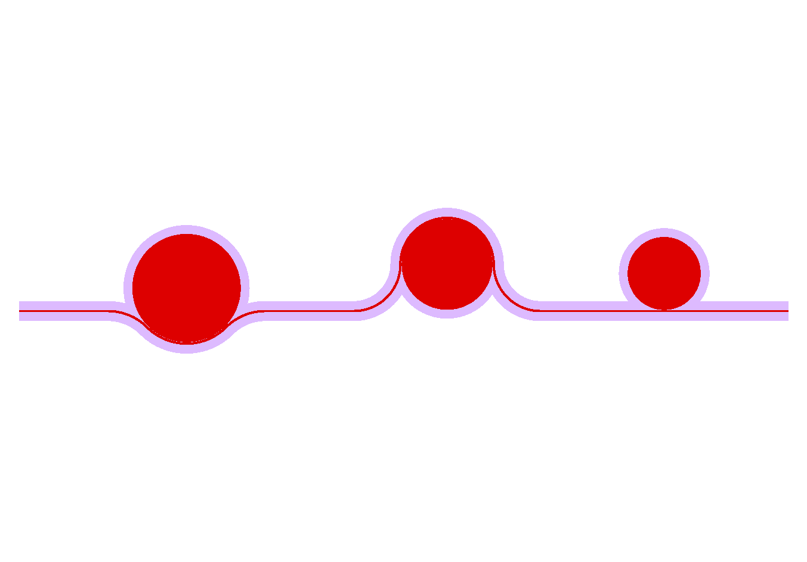

Cavities and Resonators
+++++++++++++++++++++++

Ring Resonators
---------------

.. automodule:: picwriter.components
   :members: Ring
   
.. image:: imgs/wrapped_rings.png

The code for generating the above three rings is::

    top = gdspy.Cell("top")
    wgt = WaveguideTemplate(bend_radius=50, resist='+')

    wg1=Waveguide([(0,0), (100,0)], wgt)
    tk.add(top, wg1)

    r1 = Ring(wgt, 60.0, 1.0, wrap_angle=np.pi/2., parity=1, **wg1.portlist["output"])

    wg2=Waveguide([r1.portlist["output"]["port"], (r1.portlist["output"]["port"][0]+100, r1.portlist["output"]["port"][1])], wgt)
    tk.add(top, wg2)

    r2 = Ring(wgt, 50.0, 0.8, wrap_angle=np.pi, parity=-1, **wg2.portlist["output"])

    wg3=Waveguide([r2.portlist["output"]["port"], (r2.portlist["output"]["port"][0]+100, r2.portlist["output"]["port"][1])], wgt)
    tk.add(top, wg3)

    r3 = Ring(wgt, 40.0, 0.6, parity=1, **wg3.portlist["output"])

    wg4=Waveguide([r3.portlist["output"]["port"], (r3.portlist["output"]["port"][0]+100, r3.portlist["output"]["port"][1])], wgt)
    tk.add(top, wg4)

    tk.add(top, r1)
    tk.add(top, r2)
    tk.add(top, r3)

    gdspy.LayoutViewer()
   
Disk Resonators
---------------

.. automodule:: picwriter.components
   :members: Disk
   

The code for generating the above three disks is::

    top = gdspy.Cell("top")
    wgt = WaveguideTemplate(bend_radius=50, resist='+')

    wg1=Waveguide([(0,0), (100,0)], wgt)
    tk.add(top, wg1)

    r1 = Disk(wgt, 60.0, 1.0, wrap_angle=np.pi/2., parity=1, **wg1.portlist["output"])

    wg2=Waveguide([r1.portlist["output"]["port"], (r1.portlist["output"]["port"][0]+100, r1.portlist["output"]["port"][1])], wgt)
    tk.add(top, wg2)

    r2 = Disk(wgt, 50.0, 0.8, wrap_angle=np.pi, parity=-1, **wg2.portlist["output"])

    wg3=Waveguide([r2.portlist["output"]["port"], (r2.portlist["output"]["port"][0]+100, r2.portlist["output"]["port"][1])], wgt)
    tk.add(top, wg3)

    r3 = Disk(wgt, 40.0, 0.6, parity=1, **wg3.portlist["output"])

    wg4=Waveguide([r3.portlist["output"]["port"], (r3.portlist["output"]["port"][0]+100, r3.portlist["output"]["port"][1])], wgt)
    tk.add(top, wg4)

    tk.add(top, r1)
    tk.add(top, r2)
    tk.add(top, r3)

    gdspy.LayoutViewer()
