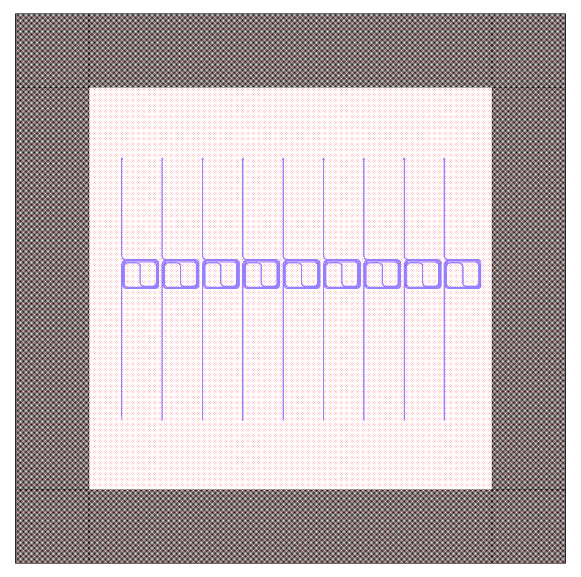

Tutorial
********

Getting started with PICwriter is easy.  In the examples below, we'll walk you through quickly generating a couple lithography masks.

Basic code structure
====================

Every file should start with the following import statements::

    import gdspy
    from picwriter import toolkit as tk
    import picwriter.components as pc

The first statement allows us to use the base commands from the gdspy library.  The second provides additional functionality for working with the picwriter components, which are imported with the third statement.  Next, we can create a top-level cell that we will add all of our PIC components to::

    top = gdspy.Cell("top")

Note: some IDE's such as Spyder do not reload the GdsLibrary() between subsequent runs, and so adding `gdspy.current_library = gdspy.GdsLibrary()` below the import statements may fix potential name-clashes.  Now, we can just add a simple geometric shape from the gdspy library, such as a square::

    top.add(gdspy.Rectangle((0,0), (1000, 1000), layer=100, datatype=0))

Let's add a simple waveguide with a bend.  To do this, we only need a reference to a WaveguideTemplate reference, and a set of waypoints (i.e. a list of (x,y) tuples).  The WaveguideTemplate class specifies all important parameters, such as resist type, waveguide width, cladding width, bending radius, then the layer and datatype::

    wgt = pc.WaveguideTemplate(wg_width=0.45, clad_width=10.0, bend_radius=100, resist='+', fab='ETCH',
                        	wg_layer=1, wg_datatype=0, clad_layer=2, clad_datatype=0)
    wg = pc.Waveguide([(25, 25), (975, 25), (975,500), (25,500),(25,975),(975,975)], wgt)

We then add this to the top cell using the toolkit "add" method::

    tk.add(top, wg)

This is simply a shortcut for the gdspy add method (which would look like `top.add(gdspy.CellReference(subcell))`.  Both are equivalent, though the first is slightly less typing.  To generate the mask according to the fab specifications (positive/negative resist, and fabrication type), we can call the `tk.build_mask()` function::

    tk.build_mask(top, wgt, final_layer=3, final_datatype=0)

This simply takes the waveguide layer and the cladding layer, then does the appropriate 'xor' operation (or just simply returns the waveguide layer).  Alternatively, you could just skip this and use KLayout (or an equivalent application) to perform the necessary boolean operations.  Lastly, we can visualize everything by either visualizing with the built-in gdspy LayoutViewer, or exporting to a GDSII file in the working directory of your python script::

    gdspy.LayoutViewer()
    gdspy.write_gds('tutorial.gds', unit=1.0e-6, precision=1.0e-9)

The 'units' specifies we are using microns as the base unit, and 'precision' specifies 1 nm precision.

Tutorial 1 program
++++++++++++++++++

Below is the entire program, along with an image of the GDSII file it generates::

    import gdspy
    from picwriter import toolkit as tk
    import picwriter.components as pc

    top = gdspy.Cell("top")
    wgt = pc.WaveguideTemplate(wg_width=0.45, clad_width=10.0, bend_radius=100, resist='+', fab='ETCH',
                        	wg_layer=1, wg_datatype=0, clad_layer=2, clad_datatype=0)

    top.add(gdspy.Rectangle((0,0), (1000, 1000), layer=100, datatype=0))
    wg = pc.Waveguide([(25, 25), (975, 25), (975,500), (25,500),(25,975),(975,975)], wgt)
    tk.add(top, wg)

    tk.build_mask(top, wgt, final_layer=3, final_datatype=0)

    gdspy.LayoutViewer()
    gdspy.write_gds('tutorial.gds', unit=1.0e-6, precision=1.0e-9)

The results should look like this, if we select only the final layer (3/0) and layer for the square (100/0):

.. image:: imgs/tutorial1.png

Putting multiple components together
====================================

Here we show how to generate a slightly more complex mask using the set of supported components that come standard in the picwriter library.  Let's build up an interesting object, a Mach-Zehnder interferometer, which consists of two 1x2 MMI's, and one arm that is much longer than the other.  But to make it longer, we need to use a `spiral` type of waveguide (for compactness).

Unbalanced Mach-Zehnder interferometer with spiral arm
+++++++++++++++++++++++++++++++++++++++++++++++++++++++

As usual, we begin with the import statements, a 'top' cell, and a standard waveguide template.  We then place a grating coupler for light to be coupled onto the PIC.  The 'port' and 'direction' keyword arguments (kwargs) specify the location of the port, and the direction that light goes *into* the device, so we specify (0,0) and `'WEST'`.  We also specify a waveguide that extends for 200 um::

    import gdspy
    from picwriter import toolkit as tk
    import picwriter.components as pc

    top = gdspy.Cell('top')
    wgt = pc.WaveguideTemplate(wg_width=0.45, clad_width=10.0, bend_radius=60, resist='+', fab='ETCH', wg_layer=1, wg_datatype=0, clad_layer=2, clad_datatype=0)

    gc1 = pc.GratingCouplerFocusing(wgt, focus_distance=20.0, width=20, length=40, period=1.0, dutycycle=0.7, port=(100,0), direction='WEST')
    tk.add(top, gc1)

    wg1 = pc.Waveguide([gc1.portlist['output']['port'], (200,0)], wgt)
    tk.add(top, wg1)

We can now add a 1x2 MMI.  Rather than calculate the location of each port and direction the waveguide should go in, we can *unpack* the relevant port and direction information from the component we are connecting to.  We do this by passing `**wg1.portlist['output']` to the input of the MMI1x2 class.  wg1.portlist is simply a python dictionary that contains the keys 'port' and 'direction', and the two asterisks unpack the corresponding port and direction values the new MMI1x2 object.  We can then add the second MMI, which will be some distance away from the first one::

    mmi1 = pc.MMI1x2(wgt, length=50, width=10, taper_width=2.0, wg_sep=3, **wg1.portlist['output'])
    tk.add(top, mmi1)

    mmi2 = pc.MMI1x2(wgt, length=50, width=10, taper_width=2.0, wg_sep=3, port=(1750, 0), direction='WEST')
    tk.add(top, mmi2)

We can explicitly get the (x,y) value of the ports by referencing the corresponding 'port' in the MMI's portlist, then use these values to build a waveguide bend up towards where we will create the spiral::

    (xtop, ytop) = mmi1.portlist['output_top']['port']
    wg2 = pc.Waveguide([(xtop, ytop),
                 (xtop+100, ytop),
                 (xtop+100, ytop+200),
                 (xtop+200, ytop+200)], wgt)
    tk.add(top, wg2)

Next, we add the spiral at the location where the previous waveguide ended.  Then at the output of the spiral, we place another waveguide connecting to the spiral output to the 2x1 MMI::

    sp = pc.Spiral(wgt, 600.0, 1000.0, 8000.0, parity=-1, **wg2.portlist['output'])
    tk.add(top, sp)

    (xtop_out, ytop_out) = sp.portlist['output']['port']
    (xmmi_top, ymmi_top) = mmi2.portlist['output_bot']['port']
    wg_spiral_out = Waveguide([(xtop_out, ytop_out),
                            (xmmi_top-100, ytop_out),
                            (xmmi_top-100, ytop_out-200),
                            (xmmi_top, ytop_out-200)], wgt)

We then add a waveguide for the bottom 'arm' of the Mach-Zehnder that directly connects the first MMI to the second MMI::

    (xbot, ybot) = mmi1.portlist['output_bot']['port']
    wg3 = pc.Waveguide([(xbot, ybot),
                 (xbot+100, ybot),
                 (xbot+100, ybot-200),
                 (xmmi_top-100, ybot-200),
                 (xmmi_top-100, ybot),
                 (xmmi_top, ybot)], wgt)
    tk.add(top, wg3)

The last grating coupler then is placed at the location of the second MMI 'port', plus an additional 100 um in the '+x' direction::

    gc2 = pc.GratingCouplerFocusing(wgt, focus_distance=20.0, width=20, length=40, period=1.0, dutycycle=0.7,
    port=(mmi2.portlist['input']['port'][0]+100, mmi2.portlist['input']['port'][1]), direction='EAST')
    tk.add(top, gc2)

    wg_gc2 = pc.Waveguide([mmi2.portlist['input']['port'], gc2.portlist['output']['port']], wgt)
    tk.add(top, wg_gc2)

Our mask is now ready to be 'built' and visualized::

    tk.build_mask(top, wgt, final_layer=3, final_datatype=0)

    gdspy.LayoutViewer()
    gdspy.write_gds('tutorial2.gds', unit=1.0e-6, precision=1.0e-9)

Tutorial 2 program
++++++++++++++++++

Altogether, the entire code for the example is shown below::

    import gdspy
    from picwriter import toolkit as tk
    import picwriter.components as pc

    top = gdspy.Cell('top')
    wgt = pc.WaveguideTemplate(wg_width=0.45, clad_width=10.0, bend_radius=60, resist='+', fab='ETCH', wg_layer=1, wg_datatype=0, clad_layer=2, clad_datatype=0)

    gc1 = pc.GratingCouplerFocusing(wgt, focus_distance=20.0, width=20, length=40, period=1.0, dutycycle=0.7, port=(100,0), direction='WEST')
    tk.add(top, gc1)

    wg1 = pc.Waveguide([gc1.portlist['output']['port'], (200,0)], wgt)
    tk.add(top, wg1)

    mmi1 = pc.MMI1x2(wgt, length=50, width=10, taper_width=2.0, wg_sep=3, **wg1.portlist['output'])
    tk.add(top, mmi1)

    mmi2 = pc.MMI1x2(wgt, length=50, width=10, taper_width=2.0, wg_sep=3, port=(1750, 0), direction='WEST')
    tk.add(top, mmi2)

    (xtop, ytop) = mmi1.portlist['output_top']['port']
    wg2 = pc.Waveguide([(xtop, ytop),
                 (xtop+100, ytop),
                 (xtop+100, ytop+200),
                 (xtop+200, ytop+200)], wgt)
    tk.add(top, wg2)

    sp = pc.Spiral(wgt, 800.0, 8000.0, parity=-1, **wg2.portlist['output'])
    tk.add(top, sp)

    (xtop_out, ytop_out) = sp.portlist['output']['port']
    (xmmi_top, ymmi_top) = mmi2.portlist['output_bot']['port']
    wg_spiral_out = pc.Waveguide([(xtop_out, ytop_out),
                            (xmmi_top-100, ytop_out),
                            (xmmi_top-100, ytop_out-200),
                            (xmmi_top, ytop_out-200)], wgt)
    tk.add(top, wg_spiral_out)

    (xbot, ybot) = mmi1.portlist['output_bot']['port']
    wg3 = pc.Waveguide([(xbot, ybot),
                 (xbot+100, ybot),
                 (xbot+100, ybot-200),
                 (xmmi_top-100, ybot-200),
                 (xmmi_top-100, ybot),
                 (xmmi_top, ybot)], wgt)
    tk.add(top, wg3)

    gc2 = pc.GratingCouplerFocusing(wgt, focus_distance=20.0, width=20, length=40, period=1.0, dutycycle=0.7,
    port=(mmi2.portlist['input']['port'][0]+100, mmi2.portlist['input']['port'][1]), direction='EAST')
    tk.add(top, gc2)

    wg_gc2 = pc.Waveguide([mmi2.portlist['input']['port'], gc2.portlist['output']['port']], wgt)
    tk.add(top, wg_gc2)

    tk.build_mask(top, wgt, final_layer=3, final_datatype=0)

    gdspy.LayoutViewer(cells=top)
    gdspy.write_gds('tutorial2.gds', unit=1.0e-6, precision=1.0e-9)

The resulting GDSII file looks like this:

.. image:: imgs/tutorial2.png

And the waveguide & cladding layers that are generated are shown below:

.. image:: imgs/tutorial2_layers.png

Generating Hierarchical PCells
==============================

In the next example, we show how easy it is to generate and reuse hierarchical PCells to quickly populate a mask with many similar components in different locations.  In the program below, we create a gdspy.Cell class called 'spiral_unit', then add different components, just like we would have added them to the 'top' cell before.  However, we can now create multiple references to this cell through gdspy.CellReference, and place them in several different locations on our mask.  This has several advantages:  (1) the time to making a mask with repeating units is reduced, and (2) the GDSII file size is reduced since we only need to store the information about one 'cell' and the locations of all the cell references (as opposed to storing the memory for each cell multiplied by the number of cells we place!).  The full program is below::

    import numpy as np
    import gdspy
    from picwriter import toolkit as tk
    import picwriter.components as pc

    X_SIZE, Y_SIZE = 15000, 15000
    exclusion_region = 2000.0 #region where no devices are to be fabricated
    x0, y0 = X_SIZE/2.0, Y_SIZE/2.0 #define origin of the die
    step = 100.0 #standard spacing between components

    top = gdspy.Cell("top")

    wgt = pc.WaveguideTemplate(wg_width=0.45, clad_width=10.0, bend_radius=100,
                          resist='+', fab='ETCH', wg_layer=1, wg_datatype=0,
                          clad_layer=2, clad_datatype=0)

    """ Add a die outline, with exclusion, from gdspy geometries found at
    http://gdspy.readthedocs.io/en/latest/"""
    top.add(gdspy.Rectangle((0,0), (X_SIZE, Y_SIZE), layer=6, datatype=0))
    top.add(gdspy.Rectangle((0, Y_SIZE-exclusion_region), (X_SIZE, Y_SIZE), layer=7, datatype=0))
    top.add(gdspy.Rectangle((0, 0), (X_SIZE, exclusion_region), layer=7, datatype=0))
    top.add(gdspy.Rectangle((0, 0), (exclusion_region, Y_SIZE), layer=7, datatype=0))
    top.add(gdspy.Rectangle((X_SIZE-exclusion_region, 0), (X_SIZE, Y_SIZE), layer=7, datatype=0))

    """ Add some components from the PICwriter library """
    spiral_unit = gdspy.Cell("spiral_unit")
    sp1 = pc.Spiral(wgt, 1000.0, 10000, parity=1, port=(500.0+exclusion_region+4*step,y0))
    tk.add(spiral_unit, sp1)

    wg1=pc.Waveguide([sp1.portlist["input"]["port"], (sp1.portlist["input"]["port"][0], 4000.0)], wgt)
    wg2=pc.Waveguide([sp1.portlist["output"]["port"], (sp1.portlist["output"]["port"][0], Y_SIZE-4000.0)], wgt)
    tk.add(spiral_unit, wg1)
    tk.add(spiral_unit, wg2)

    tp_bot = pc.Taper(wgt, length=100.0, end_width=0.1, **wg1.portlist["output"])
    tk.add(spiral_unit, tp_bot)

    gc_top = pc.GratingCouplerFocusing(wgt, focus_distance=20, width=20, length=40,
                                  period=0.7, dutycycle=0.4, wavelength=1.55,
                                  sin_theta=np.sin(np.pi*8/180), **wg2.portlist["output"])
    tk.add(spiral_unit, gc_top)

    for i in range(9):
       top.add(gdspy.CellReference(spiral_unit, (i*1100.0, 0)))

    tk.build_mask(top, wgt, final_layer=3, final_datatype=0)

    gdspy.LayoutViewer(cells=top)
    gdspy.write_gds('mask_template.gds', unit=1.0e-6, precision=1.0e-9)

